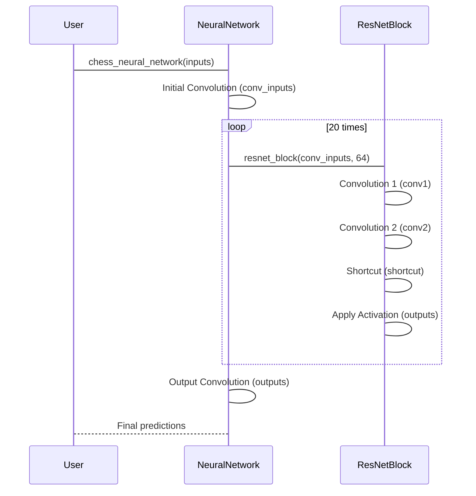

# What are ResNets?
Certainly! In the context of Alpha Zero, ResNet refers to a specific type of neural network architecture that is used within the chess engine. Let me explain ResNet in a way that's easy to understand.

Imagine you have a big puzzle to solve, but it's so complicated that you might get overwhelmed and lose track of your progress. ResNet is like having a bunch of smaller puzzle pieces that are easier to handle.

In the case of Alpha Zero, the neural network is divided into several blocks, and each block is a set of puzzle pieces. These blocks help break down the chess game into manageable parts for the neural network to analyze.

Now, why is it called ResNet? Well, "ResNet" stands for "Residual Network." The term "residual" refers to the fact that these blocks contain a special kind of connection called a "skip connection."

Think of a skip connection as a shortcut. When solving a puzzle, you might find that you've already solved a smaller part of it. Instead of starting from scratch, you can take a shortcut and use the solution you already have. In ResNet, these skip connections allow the network to reuse previous information and make it easier to train the network effectively.

By using ResNet architecture, Alpha Zero can learn and understand different aspects of chess by breaking down the game into smaller, more manageable parts. Each block in the ResNet contributes to capturing important patterns and strategies that help Alpha Zero make intelligent moves on the chessboard.
Certainly! I can provide you with a simplified code example that demonstrates the functionality of ResNet using skip connections. Keep in mind that this is a simplified version, and the actual implementation in Alpha Zero is more complex. However, this should give you a basic idea of how it works.

```python
import tensorflow as tf

def resnet_block(inputs, filters):
    # Convolutional layer 1
    conv1 = tf.layers.conv2d(inputs, filters, kernel_size=3, padding='same', activation=tf.nn.relu)

    # Convolutional layer 2
    conv2 = tf.layers.conv2d(conv1, filters, kernel_size=3, padding='same', activation=None)

    # Skip connection
    shortcut = inputs + conv2

    # Apply activation function
    outputs = tf.nn.relu(shortcut)

    return outputs

def chess_neural_network(inputs):
    # Input layer
    conv_inputs = tf.layers.conv2d(inputs, 64, kernel_size=3, padding='same', activation=tf.nn.relu)

    # ResNet blocks
    for _ in range(20):
        conv_inputs = resnet_block(conv_inputs, 64)

    # Output layer
    outputs = tf.layers.conv2d(conv_inputs, num_classes, kernel_size=1, padding='same', activation=None)

    return outputs
```

In this code example, we define two functions. The `resnet_block` function represents a single block within the ResNet architecture. It takes an input tensor `inputs` and the number of filters `filters` as parameters.

Inside the `resnet_block`, we perform two convolutional operations (`conv1` and `conv2`) with a ReLU activation function. The skip connection is implemented by adding the input tensor (`inputs`) to the output of the second convolution (`conv2`). Then, we apply the ReLU activation function to the sum of the skip connection and the output is returned.

The `chess_neural_network` function represents the overall architecture of the chess neural network. It starts with an initial convolutional layer (`conv_inputs`), followed by multiple ResNet blocks in a loop. In this simplified example, we use 20 ResNet blocks.

Finally, an output layer is added to produce the final predictions. The output layer consists of a convolutional layer (`outputs`) with a kernel size of 1, padding of 'same', and no activation function applied.

This is just a simplified demonstration of how ResNet and skip connections can be implemented in code. The actual implementation in Alpha Zero is more intricate, but this should help you understand the basic concept.

Certainly! Here's a Mermaid sequence diagram that illustrates the high-level control flow of the code snippet I provided earlier:



In this sequence diagram:

1. The User initiates the `chess_neural_network` function by passing the `inputs` to the NeuralNetwork.
2. The NeuralNetwork starts with an initial convolution (`conv_inputs`).
3. The NeuralNetwork enters a loop that represents the 20 ResNet blocks.
4. Within each iteration of the loop, the NeuralNetwork calls the `resnet_block` function and passes `conv_inputs` and the number of filters (64) as parameters.
5. The ResNetBlock performs Convolution 1 (`conv1`), Convolution 2 (`conv2`), adds the skip connection, and applies the activation function to produce the `outputs`.
6. The NeuralNetwork repeats the loop for all 20 ResNet blocks.
7. After the loop, the NeuralNetwork performs the final output convolution (`outputs`).
8. The NeuralNetwork sends the final predictions back to the User.

This sequence diagram provides a high-level overview of the control flow, illustrating how the code progresses from the User's initial call to the NeuralNetwork's final output.

# What is "Convolutional"?
Sure! Let's start by explaining what **convolutional** operations are, and then we'll discuss the data structures used in the code snippet.

In the context of neural networks, **convolutional** operations are mathematical operations performed on data, typically used for analyzing images or other grid-like structures. **Convolutional** layers in neural networks apply these operations to extract _features_ from the input data.

Imagine you have an image represented as a grid of pixels. Each pixel has a value representing its intensity or color. _A **convolutional** operation_ involves sliding a _small filter_, also known as a **kernel**, over this grid of pixels and performing a calculation at each position.

At each position, the filter looks at a small neighborhood of pixels and performs _element-wise multiplication_ with the corresponding values in the neighborhood. The resulting products are summed up, and the sum is assigned to the corresponding position in the output grid.

**Convolutional** layers learn to recognize various patterns or features in the input data by _adjusting the values of the filters_ during the training process. These patterns can include edges, textures, shapes, or higher-level concepts specific to the task at hand (in this case, chess).

Now, let's talk about the data structures used in the code snippet. While I don't have access to the specific variable definitions, I can provide you with a mental representation of what these variables might look like.

1. `inputs`: This represents the input data to the neural network, which could be a chessboard state encoded as a grid. It can be visualized as a **2D matrix**, where each element of the matrix corresponds to a specific feature or value at a particular position on the chessboard.

2. `conv_inputs`: This variable holds the output of the initial convolutional layer. It is also a **2D matrix**, but with potentially different dimensions based on the specific configuration of the layer and the input size. The values in `conv_inputs` represent the _activated features_ or patterns extracted from the input data by the initial convolution.

3. `conv1` and `conv2`: These variables represent the outputs of the convolutional layers within the ResNet block. Similar to `conv_inputs`, they are 2D matrices where each element represents an activated feature or pattern captured by the convolutions.

4. `shortcut`: This variable holds the result of adding the input tensor (`inputs`) and the output of the second convolution (`conv2`). It has the same dimensions as `conv_inputs` and represents the skip connection that helps preserve and reuse previous information.

5. `outputs`: This variable contains the final predictions of the neural network. It is also a **2D matrix**, typically with dimensions related to the number of output classes or categories. Each element in `outputs` represents the model's confidence or probability for a specific class.

Please keep in mind that these mental representations are simplified, and the actual dimensions and data structures may vary based on the specific implementation. They are provided to give you an intuitive understanding of how the data is structured and flows through the code snippet.